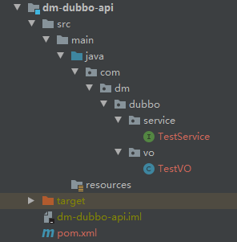
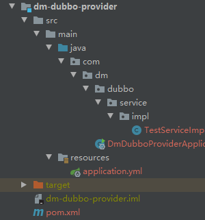
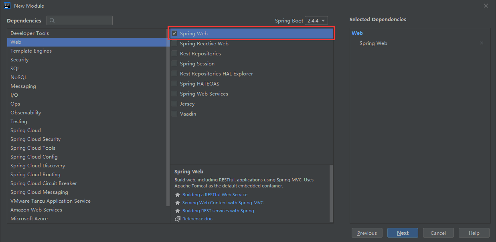
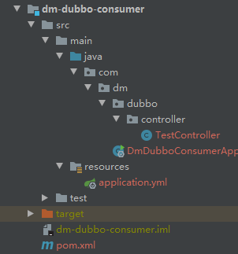

# 一个前后端分离的学习项目

## 开发环境

- JDK 1.8.0_231 (1.8.0_271)   
- Maven 3.6.3 (3.8.1)   
- IntelliJ IDEA 2019.3 (IntelliJ IDEA 2020.3.3)
- SpringBoot 2.5.1.RELEASE

# SpringBoot+Dubbo+Zookeeper的分布式示例

## 一、环境搭建

- ZooKeeper 3.6.2
- Dubbo 2.7.8

## 二、创建工程

### 1.创建接口工程 dubbo-study-api

```text
接口工程的作用：提供给消费者，用来调用方法
```

### 2.创建提供者工程 dubbo-study-provider
**(1)工程目录**   
    
**(2)创建springboot工程**   
    
**(3)引入dubbo和zookeeper依赖**
```xml
<dependencies>
    <!-- https://mvnrepository.com/artifact/org.apache.dubbo/dubbo-spring-boot-starter -->
    <dependency>
        <groupId>org.apache.dubbo</groupId>
        <artifactId>dubbo-spring-boot-starter</artifactId>
        <version>${dubbo.version}</version>
    </dependency>

    <!-- https://mvnrepository.com/artifact/org.apache.curator/curator-framework -->
    <dependency>
        <groupId>org.apache.curator</groupId>
        <artifactId>curator-framework</artifactId>
        <version>${curator.version}</version>
        <exclusions>
            <exclusion>
                <artifactId>log4j</artifactId>
                <groupId>log4j</groupId>
            </exclusion>
        </exclusions>
    </dependency>

    <!-- https://mvnrepository.com/artifact/org.apache.curator/curator-recipes -->
    <dependency>
        <groupId>org.apache.curator</groupId>
        <artifactId>curator-recipes</artifactId>
        <version>${curator.version}</version>
    </dependency>

    <!-- https://mvnrepository.com/artifact/org.apache.curator/curator-x-discovery -->
    <dependency>
        <groupId>org.apache.curator</groupId>
        <artifactId>curator-x-discovery</artifactId>
        <version>${curator.version}</version>
    </dependency>
</dependencies>
```
**(4)配置文件**
```yaml
# 端口号
server:
  port: 8088

# dubbo配置
dubbo:
  application:
    name: dubbo-provider
  protocol:
    port: 20880
    name: dubbo
  registry:
    address: zookeeper://127.0.0.1:2181
    timeout: 10000
  scan:
    base-packages: com.dm.service
```
**(5)引入接口工程**
```xml
<dependency>
    <groupId>com.dm</groupId>
    <artifactId>dubbo-study-api</artifactId>
    <version>1.0.0-SNAPSHOT</version>
</dependency>
```
**(6)实现接口中的方法**
```java
@DubboService()
public class TestServiceImpl implements TestService
{
	@Override
	public TestPO getTestPO(int id)
	{
		return new TestPO(id, "TestName", "Test@163.com", 18);
	}
}
```
**(7)注解**
```text
@DubboService()
@DubboService(version = "1.0.0")
注解中可以加版本号，同时consumer引用的时候也需要加版本号。
```

### 3.创建消费者工程 dubbo-study-consumer
**(1)工程目录**   
    
**(2)创建springboot工程**
```text
与dubbo-study-provider相同
``` 
**(3)引入dubbo和zookeeper依赖**
```text
与dubbo-study-provider相同
``` 
**(4)配置文件**
```yaml
# 端口号
server:
  port: 8089

# dubbo配置
dubbo:
  application:
    name: dubbo-consumer
  protocol:
    port: 20880
    name: dubbo
  registry:
    address: zookeeper://127.0.0.1:2181
    timeout: 10000
```
**(5)引入接口工程**
```text
与dubbo-study-provider相同
```
**(6)调用接口中的方法**
```java
@RestController
public class TestController
{
	@DubboReference
	TestService testService;

	@GetMapping("/getTestPO/{id}")
	public String getTestPO(@PathVariable("id") int id)
	{
		TestPO po = testService.getTestPO(id);
		return po.toString();
	}
}
``` 
**(7)注解**
```text
@DubboReference()
@DubboReference(version = "1.0.0")
如果provider中@DubboService()中加了版本号，那么@DubboReference()中也要加版本号。
```

### 4.属性配置
**(1)启动检查**
在有相互依赖的情况下，如果开启检查，则服务都启动不了
```yaml
dubbo:
  consumer:
    # 关闭消费者的启动时检查：（没有提供者时报错）
    check: false
```

**(2)超时时间**
优先级：消费者Method>提供者method>消费者Reference>提供者Service>消费者全局配置provider>提供者全局配置consumer。
```yaml
dubbo:
  consumer:
    # 超时时间
    timeout: 10000
  provider:
    # 超时时间
    timeout: 10000
```

**(3)重试次数**
服务超时后重试次数【retries】，不包含第一次调用，0代表不重试。   
*我们应该在幂等方法上设置重试次数【查询、删除、修改】，在非幂等方法上禁止设置重试次数。   
*幂等：指多次运行方法所产生的最终效果是一致的。   


**(4)多版本配置**
提供者@DubboService注解中增加version配置
```java
@DubboService(version = "1.0.0")
public class TestServiceImpl implements TestService
{
	@Override
	public TestPO getTestPO(int id)
	{
		return new TestPO(id, "TestName", "Test@163.com", 18, "1.0.0");
	}
}
```
```java
@DubboService(version = "2.0.0")
public class TestServiceImpl2 implements TestService
{
	@Override
	public TestPO getTestPO(int id)
	{
		return new TestPO(id, "TestName", "Test@163.com", 18, "2.0.0");
	}
}
```
消费者@DubboReference注解中增加version配置
```java
@RestController
public class TestController
{
	@DubboReference(version = "1.0.0")
	TestService testService;
}
```
```java
@RestController
public class TestController
{
	@DubboReference(version = "2.0.0")
	TestService testService;
}
```

## 三、dubbo-admin
GitHub地址：   
https://github.com/apache/dubbo-admin   
文档参考：   
https://github.com/apache/dubbo-admin/blob/develop/README_ZH.md